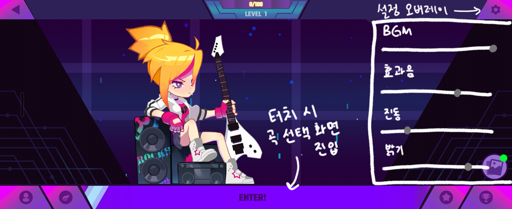
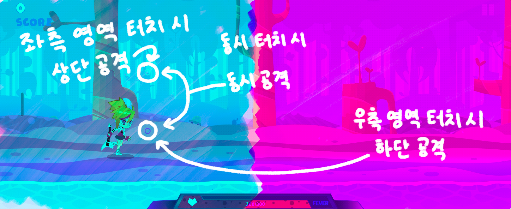
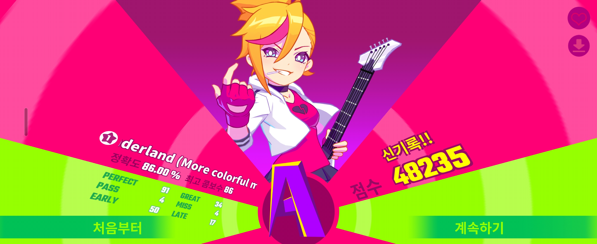

# spgp2026_VibeCosmos
TUKorea SPGP 2026 Term Project: 2D Rhythm Action Game 'Vibe Cosmos'

## 관련 링크
* **발표 영상**:
* **GitHub Repository**:
* **README.md**:

---

## 게임 컨셉
### **High Concept**
> **"광활한 우주의 선율을 타고 적을 격파하는 2D 횡스크롤 리듬 액션"**

### **핵심 메카닉**
* **듀얼 레인 타격**: 음악의 비트에 맞춰 상/하단 레인으로 다가오는 적을 터치하여 파괴
* **싱크로 시스템**: 'Choreographer'와 'Frame Time'을 활용하여 음악과 노트 생성 타이밍을 완벽히 동기화
* **역동적 등장**: 'Bezier Curve' 로직을 적용하여 적 기체가 곡선을 그리며 화면에 진입

---

## 개발 범위

| 항목 | 정량적 목표 | 관련 기술 |
| :--- | :--- | :---|
| **캐릭터** | 주인공 1종 | Sprite, Frame Animation |
| **적/노트** | 일반형, 대형형, 쌍둥이형, 롱노트형 | EnemyGenerator, Recycle, SmoothingPath |
| **배경** | 우주 성운 및 별무리 등 3중 패럴랙스 레이어 | Parallax Scroll, Layering |
| **스테이지** | 1개 곡 기준 100개 이상의 노트 배치 데이터 | Stage Data File, Choreographer |
| **시스템** | 콤보 시스템 및 결과 등급(S~F) 산출 로직 | Collision Check, Intent |

## 예상 게임 실행 흐름

1. **타이틀 화면** 
 * 시작 버튼 및 오버레이 팝업 방식의 환경 설정 기능 구현

2. **인게임 플레이** 
 * 음악에 맞춰 적이 등장하며 좌/우 터치로 상/하단의 적 격파. 콤보에 따른 점수 실시간 갱신

3. **결과 리포트** 
 * 결과 전용 액티비티 화면으로 전환하여 정확도 기반의 등급 시스템 및 최종 스코어 계산하여 산출

## 개발 일정

| 주차 | 기간 | 개발 상세 내용 |
| :--- | :--- | :--- |
| **1주차** | 04.06 - 04.12 | 기초 프레임워크 세팅 및 CustomView 기반 루프 구축 |
| **2주차** | 04.13 - 04.19 | 플레이어 Sprite 애니메이션 및 터치 입력 시스템 구현 |
| **3주차** | 04.20 - 04.26 | 3중 패럴렉스 배경 스크롤 및 우주 리소스 적용 |
| **4주차** | 04.27 - 05.03 | EnemyGenerator 기반의 기본 노트 생성 및 이동 로직 |
| **5주차** | 05.04 - 05.10 | 음악 싱크 로직 및 스테이지 데이터 로딩 구현 |
| **6주차** | 05.11 - 05.17 | 충돌 감지 및 판정(Perfect/Miss) 시스템 구축 |
| **7주차** | 05.18 - 05.24 | UI 고도화 |
| **8주차** | 05.25 - 05.31 | 성능 최적화, 최종 버그 수정 및 발표 준비 |