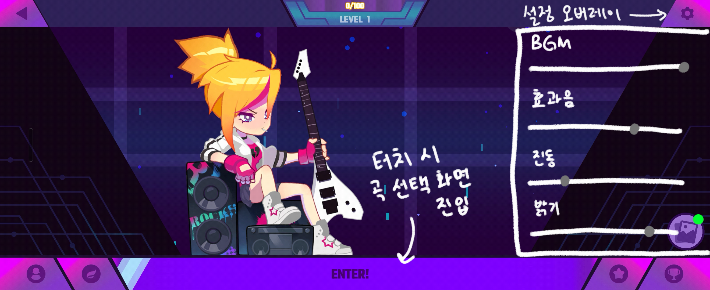
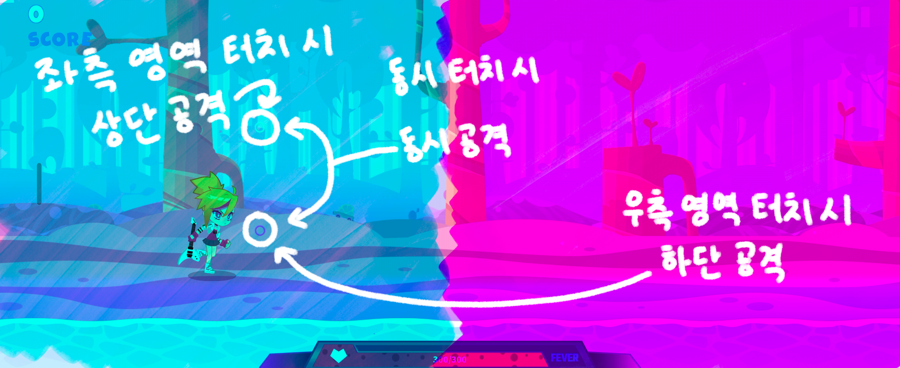
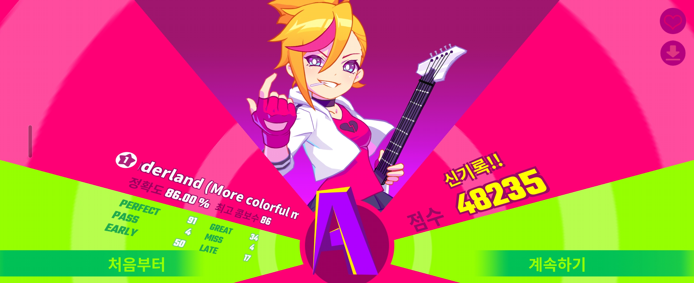
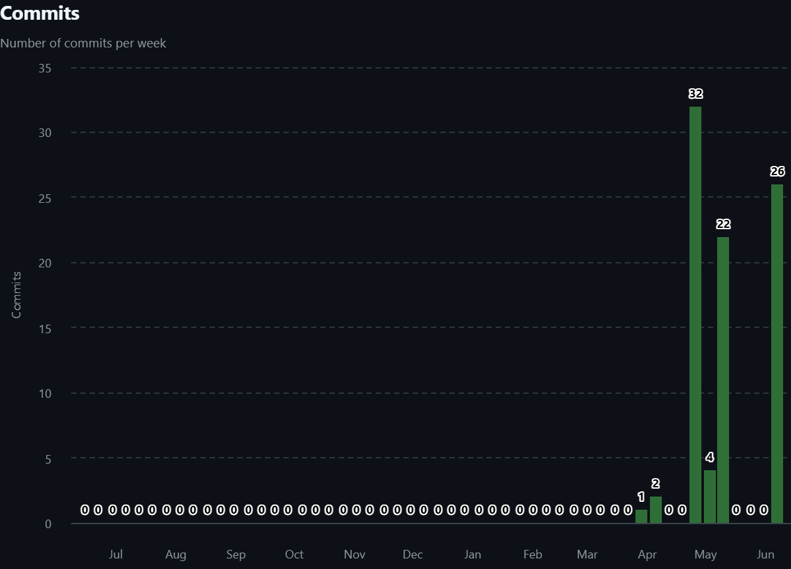

# spgp2026_VibeCosmos
TUKorea SPGP 2026 Term Project: 2D Rhythm Action Game 'Vibe Cosmos'

## 관련 링크
* **1차 발표 영상**: https://youtu.be/nNY9WgxcCcE
* **2차 발표 영상**: https://youtu.be/NpUlJM_BEF4
* **3차 발표 영상**: 
* **GitHub Repository**: https://github.com/jimw0201/spgp2026_VibeCosmos.git
* **1차 README.md**: https://github.com/jimw0201/spgp2026_VibeCosmos/blob/82825319a1162b2105a7a85d4ccb6405d930e2c7/README.md
* **2차 README.md**: https://github.com/jimw0201/spgp2026_VibeCosmos/blob/3b205f7b3a483ba7d1bd388b193411c97643b776/README.md
* **3차 README.md**: https://github.com/jimw0201/spgp2026_VibeCosmos/blob/main/README.md

---

## 게임에 대한 간단한 소개
### **High Concept**
> **"광활한 우주의 선율을 타고 적을 격파하는 2D 횡스크롤 리듬 액션"**

### **핵심 메카닉**
* **듀얼 레인 타격**: 음악의 비트에 맞춰 상/하단 레인으로 다가오는 적을 터치하여 파괴
* **싱크로 시스템**: 곡의 고유 속도(`noteSpeed`)를 기반으로 스폰 지점부터 판정선까지 도달하는 시간인 `travelTime`을 역산하여, 음악 재생 시간과 노트 생성 타이밍을 밀리초 단위로 일치시켜 동기화
* **역동적 등장**: 'Bezier Curve' 로직을 적용하여 적 기체가 곡선을 그리며 화면에 진입

---

## 개발 범위

| 항목 | 정량적 목표 | 관련 기술 |
| :--- | :--- | :---|
| **캐릭터** | 주인공 1종 | Sprite, Frame Animation |
| **적/노트** | 일반형, 대형형, 쌍둥이형, 롱노트형 | EnemyGenerator, Recycle, SmoothingPath |
| **배경** | 우주 성운 및 별무리 등 3중 패럴랙스 레이어 | Parallax Scroll, Layering |
| **스테이지** | 1개 곡 기준 100개 이상의 노트 배치 데이터 | Stage Data File, Choreographer |
| **시스템** | 콤보 시스템 및 결과 등급(S~F) 산출 로직 | Collision Check, Intent |

## 예상 게임 실행 흐름

1. **타이틀 화면** 
 * 시작 버튼 및 오버레이 팝업 방식의 환경 설정 기능 구현

2. **인게임 플레이** 
 * 음악에 맞춰 적이 등장하며 좌/우 터치로 상/하단의 적 격파. 콤보에 따른 점수 실시간 갱신

3. **결과 리포트** 
 * 결과 전용 액티비티 화면으로 전환하여 정확도 기반의 등급 시스템 및 최종 스코어 계산하여 산출

## 개발 계획/일정/실제 진행

| 주차 | 기간 | 개발 상세 내용 | 진행률 |
| :--- | :--- | :--- |:--- |
| **1주차** | 04.06 - 04.12 | 기초 프레임워크 세팅 및 CustomView 기반 루프 구축     | `[■■■■■■■■■■] 100%` |
| **2주차** | 04.13 - 04.19 | 플레이어 Sprite 애니메이션 및 터치 입력 시스템 구현    | `[■■■■■■■■■■] 100%` |
| **3주차** | 04.20 - 04.26 | 3중 패럴렉스 배경 스크롤 및 우주 리소스 적용           | `[■■■■■■■■■■] 100%` |
| **4주차** | 04.27 - 05.03 | EnemyGenerator 기반의 기본 노트 생성 및 이동 로직     | `[■■■■■■■■--] 80%` |
| **5주차** | 05.04 - 05.10 | 음악 싱크 로직 및 스테이지 데이터 로딩 구현            | `[■■■■■■■■■■] 100%` |
| **6주차** | 05.11 - 05.17 | 충돌 감지 및 판정(Perfect/Miss) 시스템 구축           | `[■■■■■■■■■■] 100%` |
| **7주차** | 05.18 - 05.24 | UI 고도화                                           | `[■■■■■-----] 50%` |
| **8주차** | 05.25 - 05.31 | 성능 최적화, 최종 버그 수정 및 발표 준비               | `[■■■■■■■■■■] 100%` |

## 개발 기술 명세

### **1. 사용된 기술 (Technologies Used)**
* **개발 언어 및 환경**: Kotlin, Android Studio 기반 배포 패키징 빌드 환경 구축
* **그래픽 및 화면 제어**: Android Canvas 2D Bitmap Matrix, `SurfaceView` 코어 루프 가속을 통한 고주사율 그래픽 렌더링 적용
* **비동기 처리**: Java Thread 구조를 활용한 타이틀 캐릭터 GIF 이미지의 비동기 런타임 디코딩 및 애니메이션 프레임 포스트 연산 처리
* **오디오 시스템**: `MediaPlayer` API 기반 배경 오디오 스트림 루핑 제어 및 오디오 레이턴시 최소화를 위한 `SoundPool` 멀티 채널링 스트림 제어 기술 결합

### **2. 참고한 것들 (References)**
* **인터페이스 디자인**: 2레인 기반 캐주얼 리듬 액션 게임인 *Muse Dash*의 상/하단 타격 포지션 및 링 레이아웃 조작 인터랙션 벤치마킹

### **3. 수업 내용에서 차용한 것 (Coursework Adaptation)**
* **`a2dg` 커스텀 게임 엔진 프레임워크 전면 응용**
  * `BaseGameActivity`, `Scene`, `World` 컴포넌트의 추상 구조를 상속받아 전체 게임의 씬 매니지먼트 라이프사이클 파이프라인 연결 및 구동
* **3중 패럴렉스 레이어 및 스크롤 기법**
  * `HorzScrollBackground` 속성을 커스텀 확장하여, 레이어별 독립적인 속도(Speed) 인자 대입을 통해 다층 구조로 무한 롤링하는 **3중 패럴렉스 우주 성운 스크롤 기술** 적용
* **스프라이트 애니메이션 구조**
  * 프레임워크의 `AnimSprite` 클래스를 상속 확장하여 스프라이트 시트 기반 런타임 행/열(`row/col`) 인덱스 연산 및 델타 타임(`gctx.frameTime`) 연동 플레이어 애니메이션 구현
* **JSON 기반 곡 정보 및 에셋 관리**
  * `AssetManager`를 통해 외부 `songs.json` 데이터 스트림을 로드 및 파싱하여 곡 제목, 오디오 파일, 채보 파일, 고유 속도 설정을 유기적으로 결합하는 **곡 카탈로그 로더** 구축
* **메모리 방어형 객체 재사용 구조**
  * 수업 중 다룬 가비지 컬렉터 관리 기법을 차용하여 화면 밖으로 나간 노트를 즉시 파괴하지 않고 `world.obtain()` 및 `IRecyclable` 인터페이스로 회수하여 인스턴스를 재활용하는 **오브젝트 풀링(Object Pooling) 구조** 적용

### **4. 직접 개발한 것 (Original Development)**
* **밀리초(ms) 단위 고정밀 오디오 역산 싱크 매니저 (`NoteManager`)**
  * 외부 에셋의 `timeMs | lane | lengthMs` 텍스트 차트 데이터를 파싱해 FIFO 구조의 데이터 큐(`Queue`)에 적재하는 채보 파서 자체 구현
  * 곡의 고유 속도(`noteSpeed`)에 따라 노트가 화면 끝에서 판정선까지 도달하는 스폰 소요 시간(`travelTime`)을 밀리초 단위로 역산, 하드웨어 주사율 렉에 영향받지 않고 오디오 타임스탬프와 완벽히 맞물려 스폰되는 **독창적인 물리 기반 싱크 엔진** 구축
* **2차 베지에 곡선(Bézier Curve) 적 기체 진입 알고리즘**
  * 일반 단타 노트 스폰 시 화면 외곽 제어점(P0, P1, P2) 사이의 프레임 타임 변화량을 2차 베지에 공식으로 보간 연산하여 동적으로 곡선을 그리며 다가오는 적 기체 이동 궤적 알고리즘 설계 및 구현
* **3단 조립형 가변 롱노트 서스테인 시스템**
  * 롱노트 데이터 파싱 시 헤드(Head), 라인(Line), 테일(Tail) 비트맵을 분리한 뒤, 연산된 `noteLengthPx`만큼 실시간으로 신축성 있게 늘려 그리는 조립식 렌더링 모듈 직접 설계
  * 홀드 지속 중 $0.1$초 간격으로 누적 점수를 계산하는 `holdTickAccumulator` 로직과, 끝부분에서 손을 떼는 릴리즈 순간 단타용 공격 사운드가 중복 출력되거나 판정이 누락되지 않도록 동적 분기하는 예외 처리 엔진 구현
* **실시간 곡 진행도 연산 및 동적 가로폭 드로우 가이드 (HUD)**
  * 인게임 화면 상단에 `MediaPlayer`의 실시간 재생률(`currentPosition / duration`)을 프레임 단위로 수집 및 가공하는 연산 모듈 탑재
  * 기존 점수판 UI와 겹치지 않도록 우측 상단 영역에 실시간으로 차오르는 상태 게이지바 구현

  ## 프로젝트 회고 및 아쉬운 점

  ### **1. 하고 싶었지만 시간 관계상 하지 못한 것**
* **다양한 패턴의 적 기체(노트) 구현 누락**
  * 최초 기획했던 적 형태 중 '대형형 적' 및 '쌍둥이형 적'의 고유 행동 패턴과 충돌 연산 로직을 시간 관계상 최종본에 완성하지 못함
* **결과 등급 산출 로직 미반영**
  * 정확도 및 스코어 기반의 결과 등급 산출 시스템을 온전히 넣지 못하고, 현재는 단순 최종 점수 계산과 판정 카운트 결과만 출력하도록 축소 구현함
* **곡 선택 레이아웃의 단조로움**
  * 수집된 곡 목록을 단순히 리스트업하고 이동하는 구조에 그쳐, 곡별 재킷 이미지나 난이도 표기 등 시각적으로 화려한 선곡 화면을 연출하지 못함

### **2. 실제 상용 출시(스토어 판매)를 위해 보충해야 할 사항**
* **저작권 프리 및 자체 제작 리소스 대체 필수**
  * 현재 개발 및 테스트 단계에서 *Muse Dash*의 그래픽/오디오 리소스를 차용하여 사용 중이므로, 상용화를 위해서는 무조건 자체 제작 리소스 및 외주 에셋으로 전면 교체하는 작업이 선행되어야 함
* **인게임 UI/UX 고도화 및 연출 보강**
  * 타이틀, 선곡, 인게임 전반의 UI 디자인 가독성을 상용 게임 수준으로 정돈하고, 콤보 달성 시 화면이 흔들리거나 파티클이 터지는 등의 피드백 연출 보충 필요

### **3. 결국 해결하지 못한 문제 / 버그**
* **없음**

### **4. 기말 프로젝트를 진행하며 겪은 어려움**
* **수동 채보 제작의 한계와 피로도**
  * 리듬 게임의 핵심인 `chart.txt` 파일을 구축할 때, 완성된 자동 제작 툴이 없어 오디오 파일을 귀로 직접 들으며 채보를 로그를 찍으며 텍스트 파일에 수동으로 기입해야 했던 과정이 가장 정교하고 물리적인 시간이 많이 소요되는 난관이었음

## 수업 소감 및 피드백

### **1. 이번 수업에서 기대한 것, 얻은 것, 얻지 못한 것**
* **기대한 것**
  * 모바일 표준 개발 환경인 안드로이드 스튜디오와 코틀린 언어의 기초 활용 능력 습득
* **얻은 것**
  * 이번 수업을 통해 안드로이드 스튜디오와 코틀린이라는 언어를 완전히 처음 접했음에도 불구하고, 수업 중 배운 내용들을 토대로 간단한 게임을 완성할 수 있을 수준의 활용 능력
* **얻지 못한 것**
  * 한 학기라는 제한된 시간적 제약으로 인해, 안드로이드 스튜디오와 코틀린 언어에 대해 깊게 파고들지 못한 것

### **2. 더 좋은 수업이 되기 위해 변화할 점**
 * 초반엔 직접 프로젝트를 만들어서 따라하며 실습을 통해 이해를 하였지만, 후반에는 다루는 콘텐츠의 양이 방대해지고 로직이 복잡해져 실시간 라이브 코딩보다는 교수님의 화면과 커밋 내역을 추적하는 데 집중해야 하여 이해가 힘들어졌다.